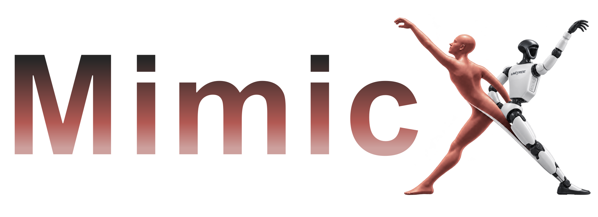
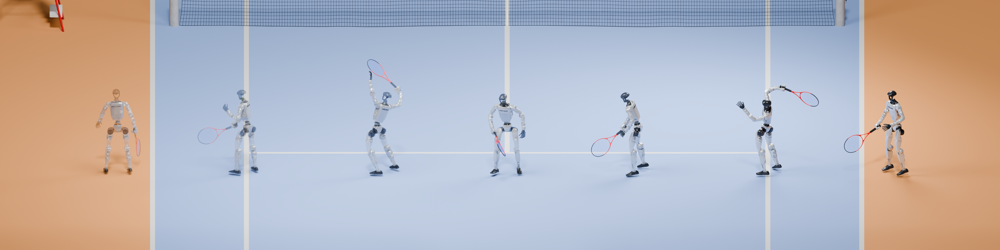
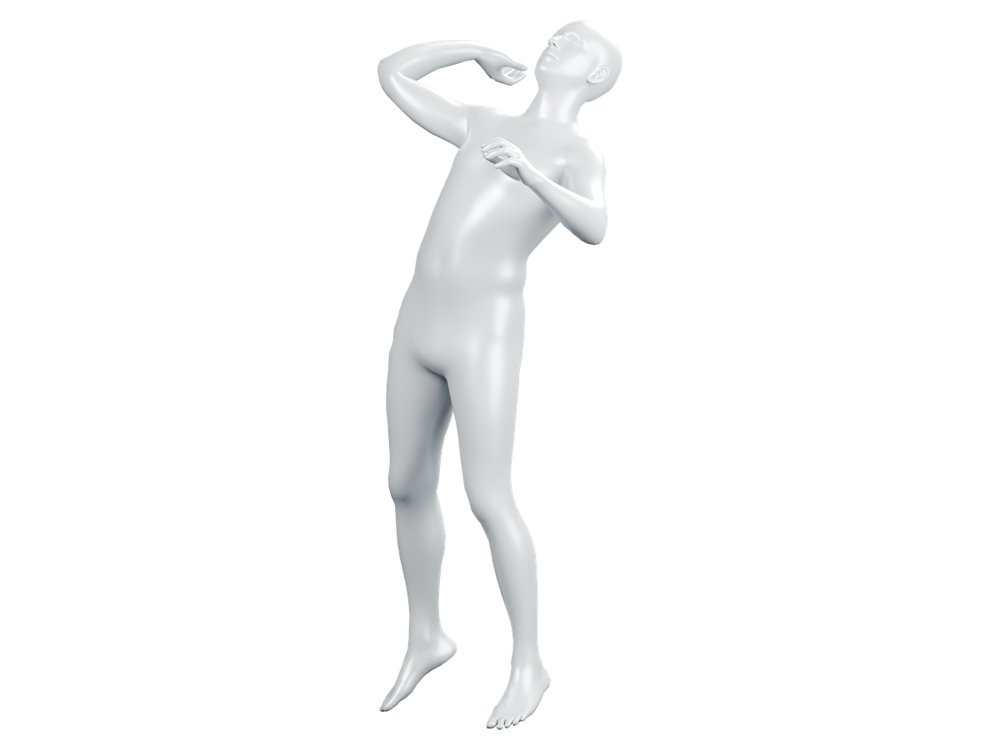
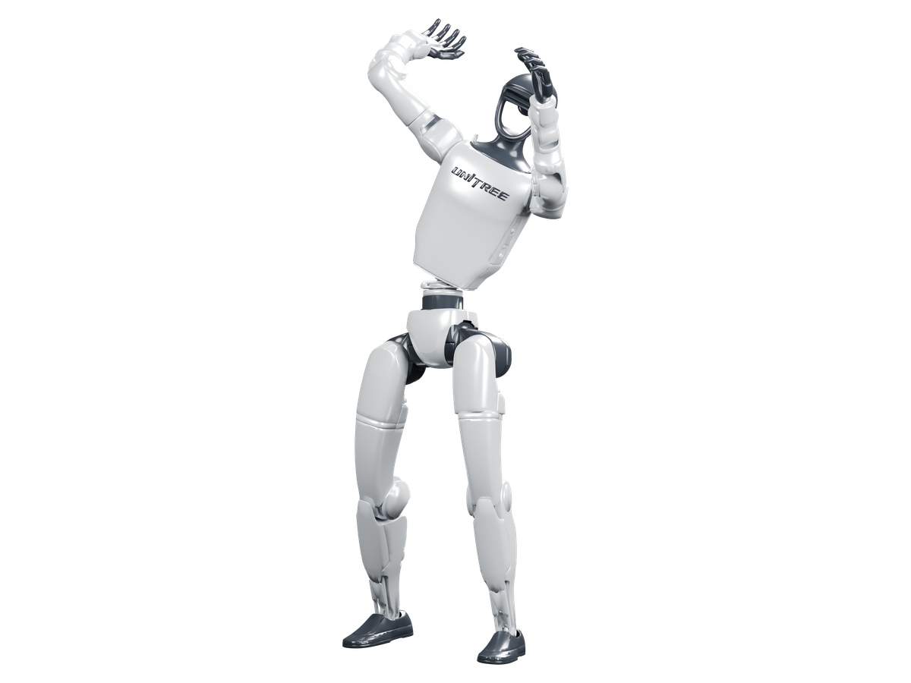
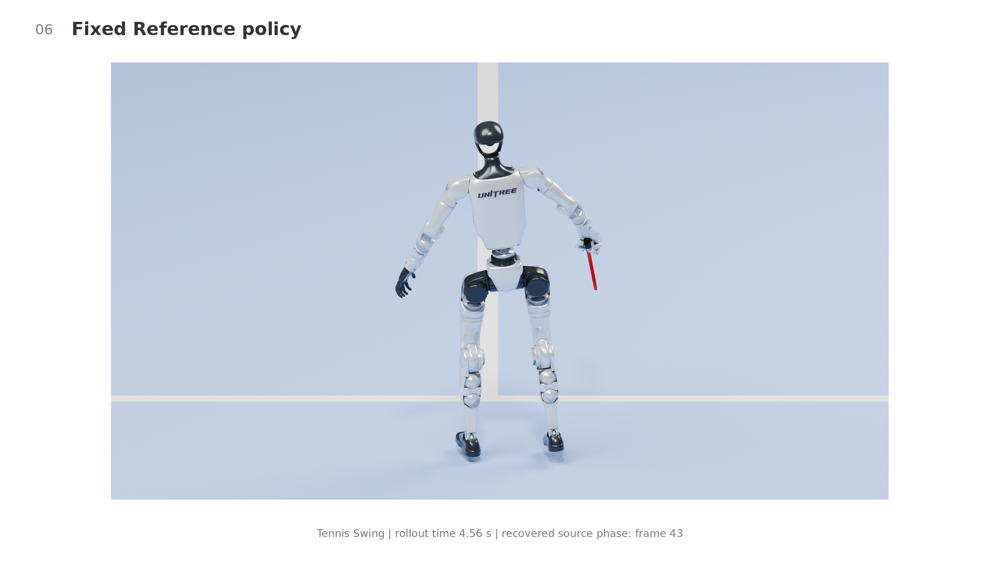
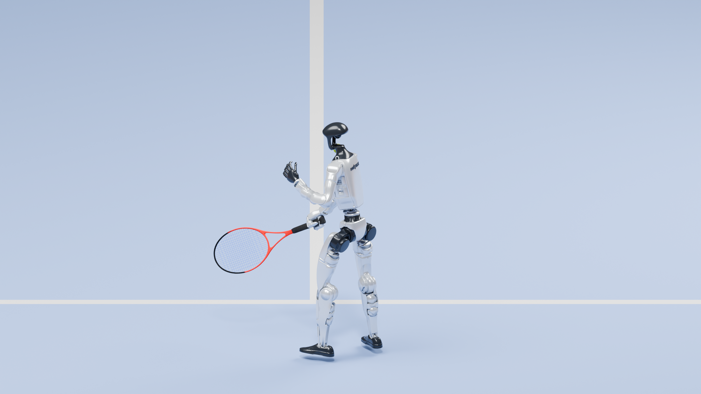

<div align="center">

<a href="https://nebulis-lab.github.io/MimicX/">
  
</a>

### Policy-in-the-Loop Supervision Refinement<br>for Video-Driven Humanoid Motion Tracking

<p>
  <a href="https://nebulis-lab.github.io/MimicX/"></a>
  <a href="https://huggingface.co/Shuaijun/MimicX-Policies"></a>
  <a href="https://huggingface.co/datasets/Shuaijun/MimicX-Assets"></a>
  <a href="https://github.com/NEBULIS-Lab/shuaijun-ICLR-paper-MimicX"></a>
</p>
<p>
  <a href="https://github.com/NEBULIS-Lab/MimicX/actions/workflows/tests.yml"></a>
  <a href="pyproject.toml"></a>
  <a href="LICENSE"></a>
</p>

**[Overview](#overview) &middot; [Quickstart](#quickstart) &middot; [Policies & Assets](#policies-and-assets) &middot; [Documentation](#documentation)**

<a href="https://nebulis-lab.github.io/MimicX/#policies">
  
</a>
<p><sub>Recorded G1 tennis policy motion. Successive poses are arranged spatially for visualization.</sub></p>

<p>
  
  &nbsp;&nbsp;
  
</p>
<p><sub>Video-reconstructed human motion (left) and its retargeted G1 reference (right).</sub></p>

<p>
  
  &nbsp;&nbsp;
  
</p>
<p><sub>Fixed-supervision policy rollout (left) and the policy after MimicX refinement (right).</sub></p>

</div>

## Overview

**MimicX** learns humanoid tracking policies from video-derived motion and
uses policy execution feedback to refine their training supervision. Rollout
diagnosis identifies difficult time windows and body regions; bounded
objective and curriculum candidates guide policy continuation. Repeated
execution checks determine whether to accept a candidate or retain the
current policy.

<p align="center">
  <strong>Human video</strong> &rarr; Human reconstruction &rarr; Robot reference &rarr; <strong>Tracking policy</strong><br>
  Policy rollouts &rarr; Failure diagnosis &rarr; Supervision refinement &rarr; <strong>Verified continuation</strong>
</p>

| Component | What it does |
| :--- | :--- |
| **Video-to-policy pipeline** | Connects GVHMR / SMPL-X reconstruction, GMR retargeting and PPO tracking in MuJoCo / MjLab. |
| **Task-aware AutoRefine** | Uses failure windows and body-error channels to propose targeted objectives and curricula. |
| **Repeated execution gate** | Checks execution improvements and tracking guards before replacing the current policy; records acceptance or protection. |
| **MimicX-HLoop** | Coordinates CPU/GPU/I/O dependencies with sequential, bulk-synchronous and dependency-ready executors, plus artifact and selection parity checks. |

Within each automated loop, the registered reference stays fixed while
training objectives and curricula are refined. Input reference preparation
is a separate stage. The [method documentation](docs/METHOD.md) describes
the implemented contract; the [project website](https://nebulis-lab.github.io/MimicX/)
contains the visual comparisons and numerical results.

## Quickstart

### Install the core package

```bash
git clone https://github.com/NEBULIS-Lab/MimicX.git
cd MimicX
python3.11 -m venv .venv
source .venv/bin/activate
python -m pip install --upgrade pip
python -m pip install -e '.[dev,visualization]'
python -m pytest -q
```

The CPU test suite includes deterministic subprocess fixtures for the complete
refinement cycle. It requires neither body models nor pretrained policies.
Physics training and evaluation additionally use the
[pinned tracking backend](dependencies/README.md).

### Choose a workflow

| Goal | Start here |
| :--- | :--- |
| **Run a released policy** | Choose a [recommended policy and matching reference](https://huggingface.co/Shuaijun/MimicX-Policies/blob/main/recommended/README.md). |
| **Learn a skill from a new video** | Follow [video reconstruction, retargeting and tracking](docs/QUICKSTART.md). |
| **Refine an existing policy** | Create a manifest and [run or resume AutoRefine](docs/QUICKSTART.md#autorefine). |
| **Reproduce the paper protocols** | Prepare the checksummed inputs using the [reproduction inventory](docs/REPRODUCIBILITY.md). |

GPU entry points use the compute allocation provided by your environment.
Device IDs are process-visible indices; launchers preserve inherited GPU
visibility. The core package does not install a CUDA runtime.

## Policies and Assets

Pretrained policies and their companion motion references are hosted on
Hugging Face, separate from the source code. **Start with one task:**

<p>
  <a href="https://huggingface.co/Shuaijun/MimicX-Policies/blob/main/recommended/README.md#tennis"><strong>Tennis</strong></a> &nbsp;&middot;&nbsp;
  <a href="https://huggingface.co/Shuaijun/MimicX-Policies/blob/main/recommended/README.md#football"><strong>Football</strong></a> &nbsp;&middot;&nbsp;
  <a href="https://huggingface.co/Shuaijun/MimicX-Policies/blob/main/recommended/README.md#dance"><strong>Dance</strong></a> &nbsp;&middot;&nbsp;
  <a href="https://huggingface.co/Shuaijun/MimicX-Policies/blob/main/recommended/README.md#kungfu"><strong>Kung Fu</strong></a>
</p>

| Release | Contents |
| :--- | :--- |
| [**MimicX-Policies**](https://huggingface.co/Shuaijun/MimicX-Policies) | Recommended final policies, multi-seed baselines, warmstarts, candidate checkpoints and checkpoint provenance. |
| [**MimicX-Assets**](https://huggingface.co/datasets/Shuaijun/MimicX-Assets) | Matching robot references, public configurations, execution records and reproduction metadata. |

The [artifact usage guide](https://huggingface.co/Shuaijun/MimicX-Policies/blob/main/USAGE.md)
covers selective downloads and reconstruction of the exact core input bundle.
Pair each policy with its recorded reference and configuration: G1 29-DoF
and historical 23-DoF policies use different model layouts.

## Documentation

| Guide | Scope |
| :--- | :--- |
| [Installation](dependencies/README.md) | External dependencies, pinned backend setup and model requirements |
| [Video to Policy](docs/QUICKSTART.md) | Reconstruction, retargeting, warmstart training and AutoRefine |
| [Method](docs/METHOD.md) | Diagnosis, proposals, continuation and acceptance rules |
| [Paper Reproduction](docs/REPRODUCIBILITY.md) | Registered inputs, controlled comparisons and evaluation protocols |
| [HLoop](docs/HLOOP.md) | Heterogeneous execution, scheduling modes and parity checks |
| [Visualization](docs/VISUALIZATION.md) | Rollout videos, screenshots and exact-state replay |
| [Release Verification](docs/RELEASE.md) | Tested components and artifact checks |

<details>
<summary><strong>Repository structure</strong></summary>

| Directory | Purpose |
| :--- | :--- |
| `mimicx/refinement/` | Diagnosis-conditioned search, verification and persistent state |
| `mimicx/runtime/` | Dependency-aware execution and parity checks |
| `mimicx/adapters/` | Motion-format bridge |
| `mimicx/evaluation/` | Metric reduction and experiment evidence utilities |
| `mimicx/visualization/` | Replay, source-object registration, camera and geometry utilities |
| `backend_overlay/` | Tracking backend modifications |
| `scripts/` | Setup, conversion, training-loop and export entry points |
| `configs/paper/` | Frozen method settings and checksummed input specification |
| `docs/` | Project website and reproduction documentation |
| `tests/` | Portable CPU regression tests |

</details>

<details>
<summary><strong>Website and numerical data</strong></summary>

The [project website](https://nebulis-lab.github.io/MimicX/) presents the
method, paired policy videos and numerical evidence. Measured results live
only under `docs/assets/results/`, separate from implementation and runtime
inputs. The static page can also be opened from [docs/index.html](docs/index.html).
See [website maintenance](docs/WEBSITE.md) for rebuilding and publishing it.

</details>

## Acknowledgments and License

MimicX builds on **GVHMR, GMR, SMPL-X, MuJoCo, MjLab and RSL-RL**.
Upstream projects, pinned dependencies and their notices are listed in
[dependencies](dependencies/README.md).

Code is released under [**Apache-2.0**](LICENSE). Included Unitree hand
visualization assets retain BSD-3-Clause, and the tracking backend retains
its upstream notices. Body models, source videos, datasets and third-party
weights follow their providers' terms; obtain the required authorized inputs
separately. Demonstration imagery and scene assets retain their respective
rights. Policy checkpoints are hosted on Hugging Face, not stored in Git.
